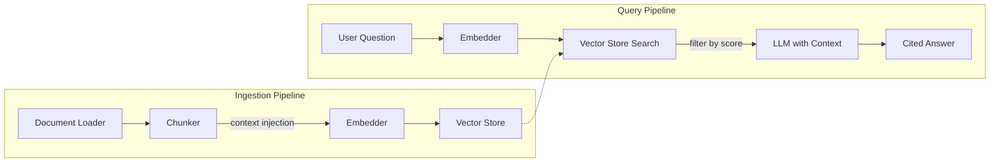

[](https://dotnet.microsoft.com/)
[](LICENSE)
[]()

# DotNetRAG

A complete **Retrieval-Augmented Generation (RAG) pipeline** built entirely in C#/.NET — no Python required.

Most RAG examples online are Python-based. This project demonstrates that .NET is a first-class platform for building AI-powered search and generation pipelines, with clean architecture, SIMD-accelerated vector search, and direct HTTP API integration.

## Architecture



### Core Components

| Component | Interface | Implementation | Description |
|-----------|-----------|---------------|-------------|
| Document Loader | `IDocumentLoader` | `PlainTextDocumentLoader` | Recursively loads `.md` and `.txt` files from a directory |
| Chunker | `IChunker` | `OverlappingChunker` | Paragraph-aware splitting with document title and section heading context injection |
| Embedder | `IEmbedder` | `LocalHashingEmbedder` | TF-IDF-weighted feature hashing with stopwords, n-grams, and term importance boost |
| Vector Store | `IVectorStore` | `InMemoryVectorStore` | SIMD-accelerated cosine similarity search |
| Retriever | `IRetriever` | `CosineSimilarityRetriever` | Composes embedder + vector store, filters by similarity threshold |
| LLM Client | `ILanguageModelClient` | `AnthropicLanguageModelClient` | Generates cited answers via Claude |

Every component is behind an interface, making it straightforward to swap implementations (e.g., replace `InMemoryVectorStore` with a Pinecone or Weaviate adapter, or swap `LocalHashingEmbedder` for a neural embedding service).

## How RAG Works

1. **Ingestion**: Documents are loaded, split into overlapping chunks (with document/section context prepended), embedded into vectors, and stored
2. **Query**: The user's question is embedded, the most similar chunks are retrieved via cosine similarity and filtered by a minimum relevance threshold
3. **Generation**: Retrieved chunks are injected as context into a prompt sent to Claude, which generates a grounded answer with inline citations

## API Endpoints

| Method | Route | Description |
|--------|-------|-------------|
| `GET` | `/api/ingest/corpora` | List available demo corpora |
| `POST` | `/api/ingest` | Ingest a selected corpus into the vector store |
| `DELETE` | `/api/ingest` | Clear the vector store |
| `POST` | `/api/query` | Ask a question against the loaded corpus |
| `GET` | `/api/diagnostics/health` | Health check with chunk count |
| `GET` | `/api/diagnostics/config` | View active configuration (Development only) |

## Getting Started

### Prerequisites

- [.NET 10 SDK](https://dotnet.microsoft.com/download)
- An [Anthropic API key](https://console.anthropic.com/)

### Setup

```bash
# Clone the repository
git clone https://github.com/paulsvh/RAGPipelineInCSharp.git
cd RAGPipelineInCSharp

# Set up your API key using .NET User Secrets (never stored in source control)
cd src/DotNetRAG.Api
dotnet user-secrets init
dotnet user-secrets set "Anthropic:ApiKey" "sk-ant-your-anthropic-key"
cd ../..

# Build and run
dotnet build
dotnet run --project src/DotNetRAG.Api
```

The API will start at `http://localhost:5292`.

### Testing Console

Open `http://localhost:5292` in a browser to use the built-in testing console. The console provides:

- **Corpus selector** — choose from 3 demo corpora (Tech Company, Cooking Recipes, Space Exploration), each with a description and document count
- **Suggested queries** — pre-built questions tailored to each corpus, click to run instantly
- **Interactive query UI** — ask your own questions with an adjustable top-k slider
- **Cited answers** — responses with numbered inline citations, collapsible source chunk cards with similarity scores
- **Health indicator** — live connection status and chunk count

Swagger UI is also available at `/swagger` for raw API exploration.

### Usage (curl)

Alternatively, use curl to interact with the API directly:

**1. List available corpora:**

```bash
curl http://localhost:5292/api/ingest/corpora
```

**2. Ingest a corpus by ID:**

```bash
curl -X POST http://localhost:5292/api/ingest \
  -H "Content-Type: application/json" \
  -d '{"corpusId": "tech-company"}'
```

**3. Ask a question:**

```bash
curl -X POST http://localhost:5292/api/query \
  -H "Content-Type: application/json" \
  -d '{"question": "What monitoring is available for Aurora Analytics?"}'
```

**4. Check the health:**

```bash
curl http://localhost:5292/api/diagnostics/health
```

### Example Response

```json
{
  "answer": "Aurora Analytics Platform integrates with the Pulse Monitoring Suite for comprehensive monitoring [cite:a1b2c3d4e5f6]. Pulse provides infrastructure and application monitoring with 15-second metric resolution, alerting rules, and integrations with PagerDuty, Slack, and OpsGenie [cite:f6e5d4c3b2a1].",
  "sourceChunks": [
    {
      "chunkId": "a1b2c3d4e5f6",
      "sourceFile": "products/aurora-analytics-platform.md",
      "chunkIndex": 2,
      "similarityScore": 0.89,
      "textPreview": "Aurora Analytics Platform integrates with..."
    }
  ],
  "modelUsed": "claude-sonnet-4-20250514",
  "usage": {
    "promptTokens": 1200,
    "completionTokens": 150,
    "chunksRetrieved": 5
  }
}
```

## Demo Corpora

The project includes 3 demo corpora designed to showcase different RAG use cases:

| Corpus | Documents | Description |
|--------|-----------|-------------|
| **Tech Company** | 9 | Internal docs for fictional Vortex Technologies: product pages, corporate policies, and engineering standards. Heavy cross-referencing between documents. |
| **Cooking Recipes** | 6 | Recipes, techniques, and kitchen guides: pasta dishes, bread baking, knife skills, spices, grilling, and desserts. |
| **Space Exploration** | 6 | Articles about the solar system, Mars missions, JWST, Moon missions, exoplanets, and rocket propulsion. |

Each corpus includes a `_meta.json` file with its name, description, and document count.

## Design Decisions

### Why raw HttpClient instead of an AI SDK?

No `Anthropic.SDK` — we call the Anthropic HTTP API directly with `HttpClient` + `IHttpClientFactory`. This keeps the dependency surface minimal, gives full control over serialization and retry logic, and demonstrates understanding of the underlying API. Resilience (retries, circuit breakers) is handled via `Microsoft.Extensions.Http.Resilience` (Polly). Per-request `HttpRequestMessage` headers ensure thread-safe concurrent access.

### Why a local embedder?

The `LocalHashingEmbedder` uses TF-IDF-weighted feature hashing with stopword filtering, term importance boost (longer words weighted higher), and unigram/bigram/trigram n-grams — all with zero external dependencies. Combined with the chunker's document title and section heading context injection, this produces effective keyword-level retrieval for the demo corpora. The `IEmbedder` interface makes it trivial to swap in a neural embedding service for production use.

### Why source-generated JSON serialization?

The Anthropic API client uses `JsonSerializerContext` for source-generated JSON serialization rather than reflection-based `System.Text.Json`. This eliminates runtime reflection costs, reduces startup time, and makes the application compatible with Native AOT compilation.

### Why in-memory vector store with SIMD?

For demo corpora of 30-70 chunks, a brute-force cosine similarity search over in-memory vectors is more than fast enough. The `InMemoryVectorStore` uses `System.Numerics.Vector<float>` for SIMD-accelerated dot product computation — hardware-accelerated math with zero external dependencies.

The `IVectorStore` interface makes it trivial to swap in a production vector database:

```csharp
// Just register a different implementation
services.AddSingleton<IVectorStore, PineconeVectorStore>();
```

### Why character-based chunking with context injection?

Token-based chunking would require a tokenizer dependency. Character-based chunking with paragraph-aware splitting is simpler, has no dependencies, and produces good results for English text. Each chunk is prepended with the document title and nearest section heading, which dramatically improves retrieval quality for keyword-based embedders. The `IChunker` interface allows swapping in token-based chunking later.

### Why a single project?

Clean Architecture with multiple class library projects would be over-engineering for this scope. Folders and namespaces provide clear separation of concerns. The interfaces enforce architectural boundaries at the code level.

## Project Structure

```
src/DotNetRAG.Api/
├── Configuration/      Strongly-typed settings with startup validation
├── Contracts/          Request/response DTOs
├── Domain/             Core domain records (DocumentChunk, EmbeddedChunk, etc.)
├── Interfaces/         6 core interfaces defining the RAG pipeline
├── Services/           All implementations + pipeline orchestrators
├── Endpoints/          Minimal API endpoint definitions
├── Middleware/          Global exception handling (RFC 9457 ProblemDetails)
├── Extensions/         DI registration with options validation
└── wwwroot/            Built-in testing console (single-page HTML)

corpus/
├── tech-company/       9 docs: products, policies, engineering standards
├── cooking-recipes/    6 docs: recipes, techniques, guides
└── space-exploration/  6 docs: solar system, missions, propulsion
```

## Configuration

All settings are in `appsettings.json` (non-secret values only):

| Setting | Default | Description |
|---------|---------|-------------|
| `Rag:ChunkSize` | 1500 | Maximum characters per chunk |
| `Rag:ChunkOverlap` | 300 | Overlap characters between adjacent chunks |
| `Rag:DefaultTopK` | 5 | Default number of chunks to retrieve |
| `Rag:MinSimilarityScore` | 0.05 | Minimum cosine similarity to include a chunk |
| `Rag:FileExtensions` | `[".md", ".txt"]` | File types to ingest |
| `Anthropic:Model` | `claude-sonnet-4-20250514` | Claude model for generation |
| `Anthropic:MaxTokens` | 2048 | Max tokens for generation |

The API key is stored via [.NET User Secrets](https://learn.microsoft.com/en-us/aspnet/core/security/app-secrets) — never committed to source control. A missing key causes a clear startup failure thanks to `ValidateOnStart`.

## Running Tests

```bash
dotnet test
```

83 tests covering: chunker logic, SIMD cosine similarity, vector store operations, retriever filtering, pipeline orchestration, citation extraction, exception handling, local embedder quality, document loader I/O, DI registration validation, API endpoint integration, and end-to-end suggested query retrieval across all 3 corpora.

## Future Improvements

- **Neural embeddings** via the `IEmbedder` interface (e.g., Voyage AI or a local ONNX model)
- **Token-based chunking** using `Microsoft.ML.Tokenizers` for more accurate chunk sizing
- **Persistent vector store** adapter for Pinecone, Weaviate, or Qdrant
- **Cross-encoder re-ranking** for more precise relevance ordering after initial retrieval
- **Streaming responses** via Server-Sent Events for real-time generation
- **Hybrid search** combining dense vector search with BM25 keyword matching

## License

MIT
